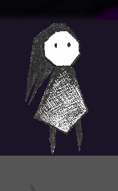
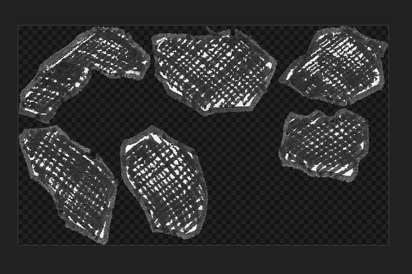
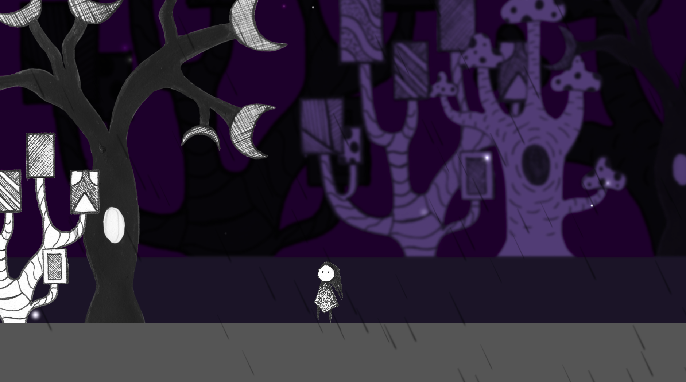
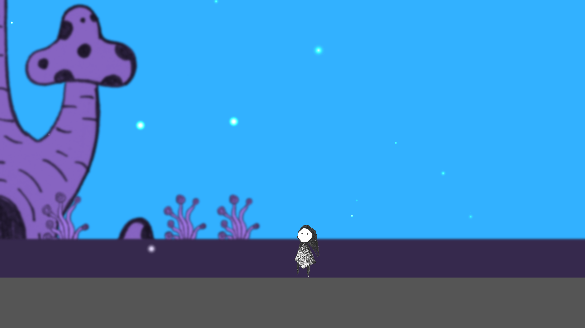
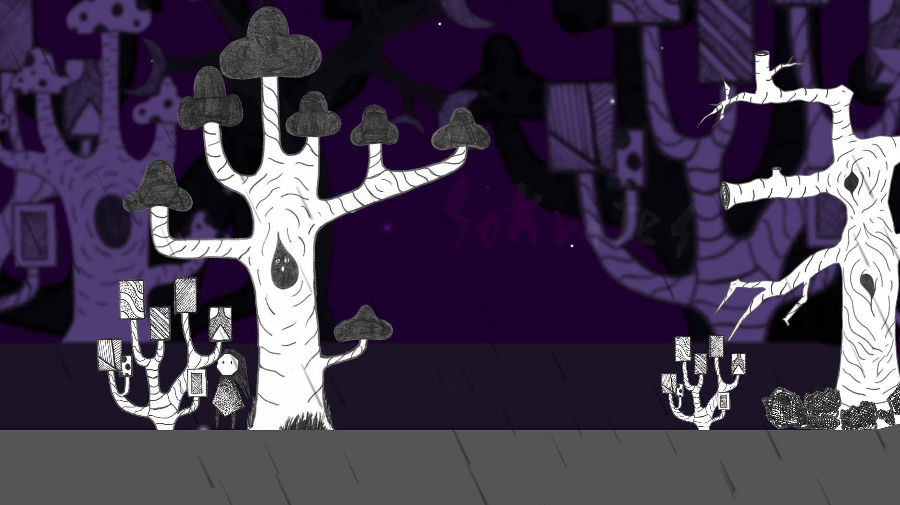
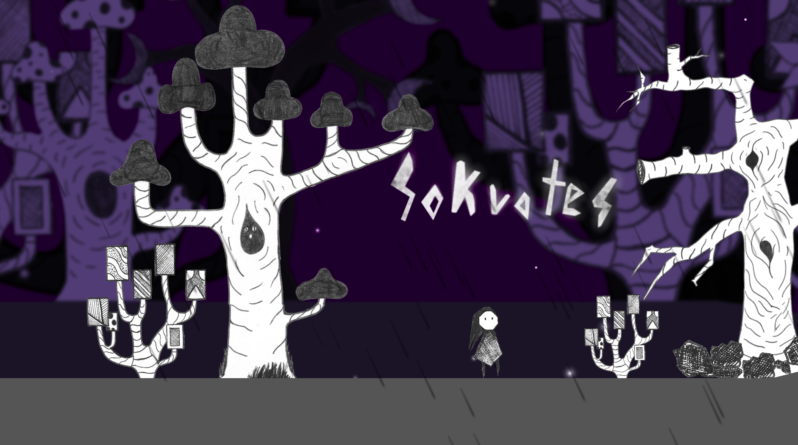

# Sokrates
Sokrates (w obecnej formie) jest szkieletem dwuwymiarowej gry przeglądarkowej powstałej na podstawie [animacji](https://www.youtube.com/watch?v=ly7p495gG1M) wykonanej w ramach lekcji etyki w liceum. Nazwa i fabuła nie nawiązuje w żaden sposób do grackiego filozofa. 
Jest to prosta gra platformowa o nieskomplikowanym stopniu trudności, gdzie większy nacisk przyłożono do prezentacji świata, niż do zaawansowanych mechanizmów rozgrywki.

Podczas rozgrywki gracz przemierza świat obserwując zmieniające się otoczenie i reagując na proste przeszkody umieszczone w świecie. Całość okraszona jest immersyjnymi efektami dźwiękowymi i dźwiękami otoczenia. 

## Użyte biblioteki i narzędzia
Całość projektu została napisana w języku Typescript i budowana była z użyciem narzędzie Webpack. Za wyświetlanie grafiki w elemencie `Canvas` używając kontekstu `2D WebGl` odpowiada biblioteka [PixiJS](https://www.pixijs.com/). Umożliwia ona wydajne wyświetlanie wielu obiektów, wykonywanie transformacji, używanie filtrów, a jej pluginy zapewniają rozszerzenie funkcjonalności między innymi o dźwięk i efekt cząst

Wszystko, co jest związane z ruchem obiektów w grze, obsługiwane jest przez silnik fizyczny [MatterJS](https://brm.io/matter-js/).

## Integracja i responsywność
Wymienione wcześniej biblioteki zostały zintegrowane, a korzystanie z nich wymaga, dla każdego obiektu świata gry, utworzenie dwóch jego składowych:

1. Obiektu PixiJS odpowiedzialnego za wyświetlanie elementów na ekranie. Na potrzeby gry korzystano z obiektu `PIXI.Graphics` oraz `PIXI.Sprite` i jego klasy pochodnej `PIXI.AnimatedSprite`.
2. Obiektu `Matter.Body`, który odpowiada za symulację bryły sztywnej.

Istotnym elementem integracji było ujednolicenie współrzędnych pozycji obiektów. PixiJS rysuje obiekty względen ich lewego górnego rogu, natomiast MatterJS tworząc obiekt `Body` zakłada punkt odniesienia w jego centroidzie. Wymagało to przesunięcie punktu dla obiektów biblioteki PixiJS.


### Responsywność
Ekran gry widoczny w przeglądarce zawsze ma proporcje 16:9 i ulega skalowaniu po zmianie rozmiaru okna przeglądarki. Biblioteka graficzna jak i silnik fizyczny nie generują obrazu na podstawie swoich rzutowanych układów współrzędnych, a na podstawie pikseli elementu `Canvas`. Aby temu zaradzić sprowadzono transformację skalowania całej sceny po zmianie proporcji ekranu. Jako punkt odniesienia przyjęto rozdzielczość `1280x720`. Przekłada się to na późniejszą definicję świata.

W celu usprawnienia procesu tworzenia świata, punkt (0, 0) odpowiada środkowi ekranu.

### Animacja i symulacja

Biblioteki co każdą klatkę symulacji wykonują proces renderowania oraz symulacji świata. W pierwszej kolejności silnik fizyczny oblicza nowe położenie obiektów, a następnie następuje proces rysowania sceny. Na końcu obliczane jest przesunięcie poszczególnych planów sceny związanych z położeniem kamery. Poniższy listing prezentuje główną pętlę gry:

```ts
loop(delta: number) {
    const ms = (1000 / 60) * delta
    Engine.update(this.engine, ms);
    this.mainScene.update(ms);
    this.camera.update(delta);
}
```

## Postać gracza
Postacią sterowaną przez gracza jest tytułowy Sokrates.



Jego obiekt zawiera definicję sprite'ów, które składają się na poszczególne animacje związane ze stanem, w jakim znajduje się obiekt. Stany obiektu definiuje poniższy enum:

```ts
enum CharacterState {
  Idle,
  MovingLeft,
  MovingRight,
}
```

Obiekt postaci jest odpowiedzialny za ustawianie swojego stanu oraz właściwości obiektu `Matter.Body` odpowiedzialnego za symulację fizyki, na podstawie zdarzeń wywołanych na obiekcie `Canvas`. 

Na przykład kiedy następuje wciśnięcie klawisza `d` i klawisz `shift` nie jest wciśnięty, następuje ustawienie prędkości w osi `X` na wartość dodatnią. Zgodnie ze stanem i kierunkiem wektora prędkości w osi `X` zmieniany jest wyświetlany i animowany sprite. Wyświetlany sprite zależy również od interakcji z innymi obiektami świata gry. Specjalny sprite wyświetla się podczas spadania, co wykrywane jest za pomocą zdarzeń silnika fizycznego.

```ts
const sokrates = new Sokrates(new PIXI.Point(-1700, 350), 0.1);
```

## Kamera i efekt paralaksy

Abstrakcję kamery, tak jak w innych środowiskach, uzyskuje się poprzez transformację wszystkich elementów sceny.

Podczas definicji sceny z obiektu kamery można pobrać kontener `PIXI.Container` o dowolnym współczynniku przesunięcia. Współczynnik ten odpowiada za modyfikację transformacji przesunięcia danej warstwy. Warstwa ze współczynnikiem `1` będzie podążać za kamerą bez przesunięcia. Warstwa ze współczynnikiem `0` będzie widoczna cały czas i będzie niezależna od ruchu kamery.

Kamera może też śledzić pozycję dowolnego obiektu gry. 

Fragment definicji sceny - utworzenie warstw i ustawienie śledzenia bohatera.
```ts
const foreforeground = this.camera.getLayer(1.05);
const foreground = this.camera.getLayer(1);
const middleground = this.camera.getLayer(0.7);
const background = this.camera.getLayer(0.2);

this.camera.follow(sokrates);
```

## Definicja świata

Wszystkie obiekty świata oparte są o klasy `PIXI.Sprite` i `PIXI.AnimatedSprite`. Wyjątek stanowią instancje klasy `Shape`, które definiują bryłę o określonym kolorze na podstawie dostarczonych punktów. Wszystkie obiekty można statycznymi oraz niekolidującymi poprzez ustawienia ich obiektu `Matter.Body`.
Wszystkie assety graficzne dostarczone są w formie sprite'ów - większych obrazów zawierających wiele mniejszych, co usprawnia ich ładowanie i cacheowanie.
Każda pochodna klasy `Sprite` musi mieć zdefiniowaną swoją teksturę, dzieje się do w konstruktorze jej klasy bazowej. Definicję klasy obiektu można porównać do prefabrykatu w Unity. Przykład dla drzewa nr 1:
```ts
export default class Tree1 extends Sprite {
  constructor(position: Vector, scale: number) {
    const trees =
      PIXI.Loader.shared.resources["assets/spritesheets/trees.json"]
        .spritesheet;
    super(position, scale, PIXI.Sprite.from(trees.textures["Drzewo_1_scale.png"]));
    this.body.isSensor = true
    this.body.isStatic = true
  }
}
```

Instancje klasy `Shape` służą z założenia do definiowania dużych wielokątów tworzących podłoże, czy elementy dekoracji tła. Mogą jednak, po odpowiednim skonfigurowaniu, służyć do utworzenia niewidzialnych ścian:
```ts
const wallLeft = new Shape(
  new PIXI.Point(-1980, -2000),
  [
    Vector.create(0, 0),
    Vector.create(100, 0),
    Vector.create(100, 3000),
    Vector.create(0, 3000),
  ],
  0x555555
);
Body.setStatic(wallLeft.body, true);
wallLeft.graphics.visible = false;
```

Każdy obiekt `PIXI.Container` może mieć zdefinoiwany nakładany niego zestaw filtrów. Dla warstw tła zdefiniowano rozmycie gaussowskie oraz pociemnienie z przesunięciem ku niebieskiemu:

```ts
...
const middleMatrixFilter = new PIXI.filters.ColorMatrixFilter();
middleMatrixFilter.matrix = ColorMatrix.blue(0.6);
middleground.filters = [new PIXI.filters.BlurFilter(5), middleMatrixFilter];
...
```

Bryły sztywne domyślnie są prostokątami utworzonymi domyślnie na podstawie rozmiaru tekstury. Aby kolizje były wiarygodnie odzwierciedlone zainstaniała konieczność ręcznego zdefiniowania punktów wielokątu tworzących bryłę sztywną dla kamieni:



## Deszcz i pył

Efekt cząsteczek został osiągnięty z wykorzystaniem pluginu [pixi-particles](https://pixijs.io/pixi-particles/docs/). Wykorzystuje on tesktury do generowanie cząsteczek w określonym obszarze.
### Deszcz
Deszcz generowany jest z wykorzystaniem trzech podłużnych czarnych smug ułożonych pod tym samym kątem poruszających się w jednym kierunku. Emiter znajduje się cały czas w tym samym miejscu względem pozycji kamery - nieco wyżej górnej krawędzi ekranu.
Oznacza to, że jest on przesuwany razem z ruchem kamery. Skutkuje to emitowaniem kropel deszczu zawsze w poprawnej pozycji i pozostawia utworzone już ktople niezależnymi od pozycji emitera i kamery.



### Pył
Pył generowany jest z wykorzystaniem tekstur białych kropek z rozmytymi krawędziami. W cyklu życia jednej cząsteczki jej kanał alfa jest animowany (0->1->0). Poprzez zastosowanie "miękkiego" pędzla podczas tworzenia tesktury, animacja kropki tworzy efekt zmiany jej rozmiaru. Cząsteczki tworzone są z losowo wybieraną pręskością i jej kierunkiem.



## Animacja

Zmiana wyglądu obiektów otoczenia bazuje na pozycji gracza lub kamery. Tytułowy napis między drzewami zmienia swoją przezroczystość w miarę zliżania się do niego bohatera.



Każdy obiekt gry może mieć zdefiniowaną metodę update, jak i dodatkowe pola, w których można umieścić inne obiekty świata gry. Poniżej metoda `update` klasy `Title` wyświetlającej napis:
```ts
update() {
  super.update();
  if (this.sokrates) {
    this.sprite.alpha = _.clamp(
      1-Math.abs(this.sokrates.body.position.x - this.body.position.x)/500,
      0,
      1
    );
  }
}
```


Płynne lub skokowe przejścia mogą być również tworzone dla każdego innego elementu sceny. Na zasadzie tej działa zmiana tła i wygaszenie deszczu - na podstawie zdefiniowanych punktów i interpolacji liniowej wartości, ustawiane tą parametry odpowiednich obiektów.

## Dźwięki
Odtwarzanie dźwięków wykorzystuje plugin [pixi-sound](https://pixijs.io/pixi-sound/examples/index.html). Każde źródło dźwięku ma ustaloną pozycję. Konstruktor klasy dźwięku wygląda następująco:
```ts
constructor(
    filename: string,
    position: Vector = Vector.create(0, 0),
    fadeFn = (d: number) => 1,
    autoPlay: boolean = true,
    loop: boolean = true
  )
```
To jak dźwięk zachowa się w odniesieniu do pozycji gracza definiuje argument `fadeFn`, który jest metodą przyjmującą argument `d`, który to z kolei jest dystansem pomiędzy źródłem dźwięku, a kamerą. Wartość domyślna tego argumentu `(d: number) => 1` oznacza, że dźwięk będzie słyszalny zawsze tak samo, z maksymalnym poziomem głośności `1`.