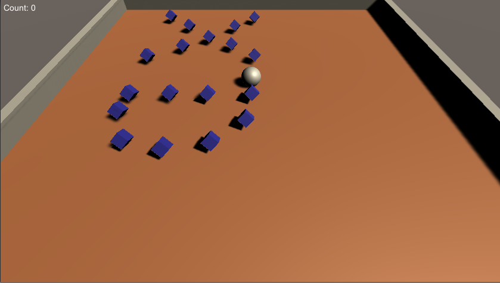
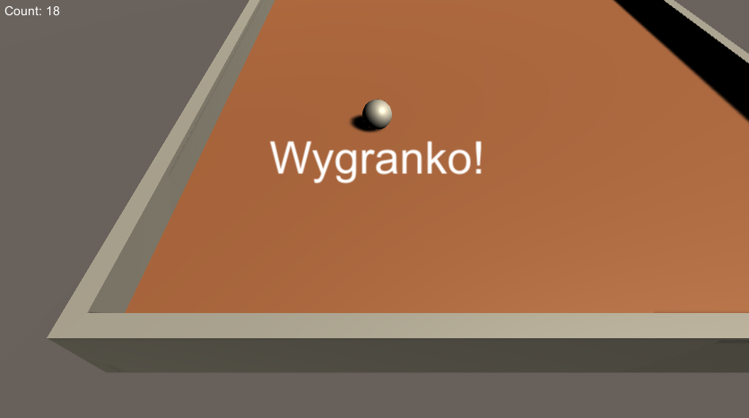
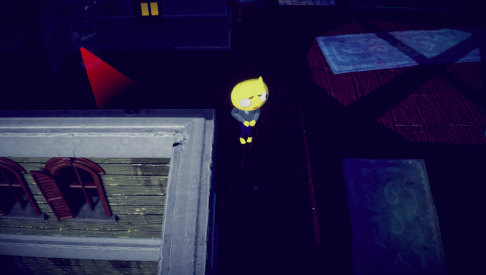
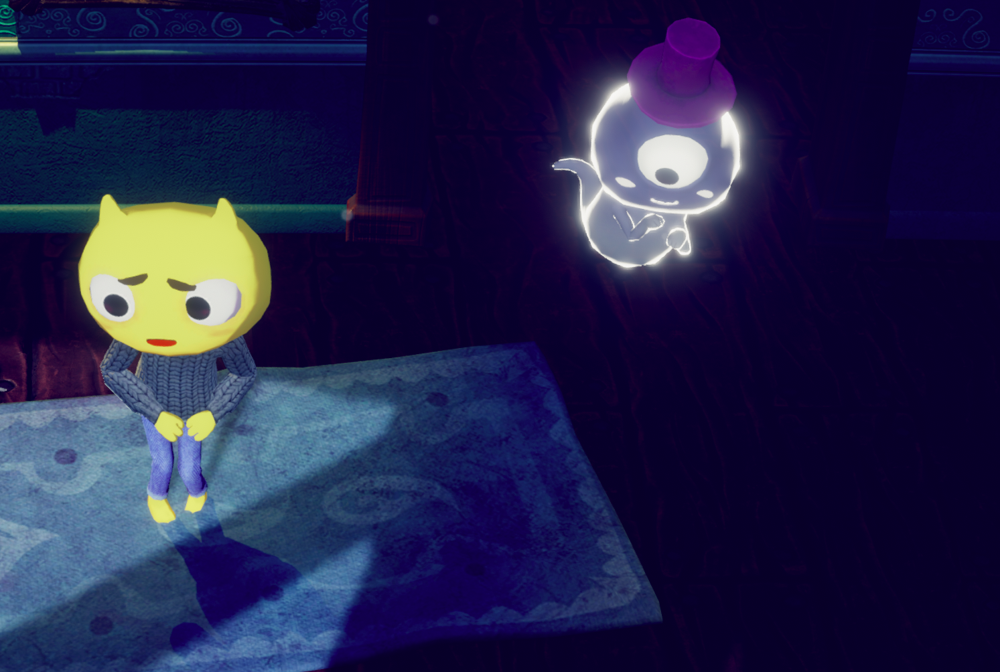

# Projektowanie i programowanie gier

## Laboratorium 1

Sprawozdanie to zawiera poznane elementy i spostrzeżenia opisywane bezpośrednio podczas wykonywania kursu. Overlay odpowiedzialny za nawigowanie i prezentowanie instrukcji drastycznie obniżał wydajność na maszynie z systemem Ubuntu. Nie miałem wcześniej doświadczenia z tworzeniem gier z wykorzystaniem tego typu narzędzi.

### FPS Microgame

Ważnym elementem programowania gier jest testowanie. Narzędzie Unity pozwala na uruchomienie gry w oknie edytora w wybranym momencie rozgrywki. Pozwala to na bieżąco sprawdzać poprawność działania i korygować błędy.

Scena reprezentowana jest poprzez model obiektowy. Zmiana właściwości obiektu gracza bezpośrednio może przenieść się na rozgrywkę. Narzędzie Unity pozwala na nawigację po scenie z użyciem wirtualnej kamery.

Powierzchnia poruszania się przeciwników nie jest dynamicznie obliczana na podstawie mapy, ale musi być jawnie przeliczona.
Kolor i inne właściwości materiałów są dostępne i modyfikowalne z poziomu interfejsu graficznego.

Dodanie przeciwnika może odbywać się jako ustawienie assetu z gotowymi ustawieniami wyglądu i zachowania na powierzchni mapy. Widać, że obiekt umieszczany jest na mapie zgodnie z wyliczoną wcześniej powierzchnią.

Utworzoną grę można zbudować na różne platformy. Grę zbudowaną na środowisko przeglądarki internetowej (WebGL) można wysłać na konto Unity i umożliwić innym zagranie. Moja testowo zbudowana gra znajduje się pod linkiem: https://connect.unity.com/mg/fps/xd-xpgkpv.

### Karting Microgame

Tutorial Karting Microgame był niemożliwy do wykonania, ponieważ, na tej samem maszynie, na systemach Ubuntu jak i Windows Unity Edytor zawieszał się na tym samym etapie - kroku 5/7 z rozdziału Playtest. Uruchamianie projektu na komputerze z systemem Windows, procesorem Intel Core i7 i kartą graficzną Nvidia GTX 1050Ti przebiegało równie wolno co na systemie Ubuntu uruchomionym na tej samej maszynie. Jak dotąd rozbudowane i "ciężkie" środowisko Unity nie dało się polubić.

### Platform Microgame

W tym projekcie przedstawiona została gra 2D z efektem paralaksy tła, który osiągnięty został poprzez użycie trzeciego wymiaru. Można to zobaczyć przełączająć się pomiędzy trybem 2D i 3D w widoku sceny. Tutorial pokazał jak zmienić kolor postaci gracza, którego kształt pochodzi ze sprite'a w odcieniach szarości, który następnie jest odpowiednio kolorowany. 

Gdy widoczny jest tutorialowy overlay, proces Unity wydaje się niepotrzebnie zużywać zasoby procesora (może kopie BitCoiny). 

Tutorial pokazał również, tak jak poprzedni z grą FPS, jak dodać przeciwnika z gotowych zasobów, a także jak zbudować i udostępnić grę z wykorzystaniem WebGL. Bazowa, udostępniona wersja projektu dostępna jest pod adresem https://connect.unity.com/mg/2d/xd2-yfvhg.

### Roll-a-ball

Na potrzeby zadania utworzony został nowy projekt, zmieniona została nazwa sceny i dodany do niej został obiekt podłoża oraz gracza - kuli. Wszystkie obiekty zostały przemieszczone na odpowiednie pozycje. Dodany został też materiał podłoża, oraz zmieniony został kąt nachylenia promieni światła, aby lepiej oświetlić gracza.

#### Zachowanie kuli

Do obiektu kuli został dodany component zapewniający obsługę zachowania ciała sztywnego (`Rigidbody`). Dodany został również skrypt, który zmienia siły działające na gracza, gdzie wartości tych sił pochodzą z interfejsu `Input`, który mapuje przyciski klawiatury na właściwe wartości. Dzięki publicznej zmiennej klasy, po skompilowaniu skryptu przez Unity, zmienna ta jest edytowalna z poziomu inspektora obiektu gracza.
```cs
using System.Collections;
using System.Collections.Generic;
using UnityEngine;

public class PlayerController : MonoBehaviour
{
    public float speed;
    private Rigidbody rb;

    void Start(){
        rb = GetComponent<Rigidbody>();
    }

    void FixedUpdate(){
        float moveHorizontal = Input.GetAxis("Horizontal");
        float moveVertical = Input.GetAxis("Vertical");

        Vector3 movement = new Vector3(moveHorizontal, 0.0f, moveVertical);
        rb.AddForce(movement * speed);
    }
}
```

#### Ruch kamery

Podłączenie kamery jako dziecko obiektu gracza w grafie sceny nie sprawdzi się, ponieważ kamera dziedziczyłaby wszystkie parametry. Zamiast tego co klatkę animacji do pozycji kamery dodawana jest różnica ich początkowej odległości, co efektywnie przekłada się na podążanie kamery za kulą we wszystkich trzech osiach, bez obracania się.

<div style="margin-bottom:100px"></div>

#### Mapa

Dodanie ścian sprowadziło się do dodania kolejnych obiektów w scenie ze zwróceniem uwagi na ich uporządkowanie.

#### Punkty

Punkty są obiektami utworzonymi na podstawie wzorcowego obiektu, z którego dziedziczą wszystkie właściwości. Punkty zostały przypisane do pustego obiektu, co pozwoliło je uporządkować. Punkty są obracającymi się kostkami. Obracanie się kostki zdefiniowane jest w metodzie `Update` kontrolera przypisanego do obiektu.

```cs
    // Update is called once per frame
    void Update()
    {
          transform.Rotate(new Vector3(15,30,45)*Time.deltaTime);     
    }
```



##### Zliczanie punktów

Zliczanie punktów odbywa się poprzez detekcję kolizji pomiędzy graczem a obiektem punktu. Zwiększa to o 1 licznik punktów, który następnie jest wyświetlany za pomocą obiektu tekstu UI.

#### Wygrana

Po zebraniu wszystkich punktów na ekranie pojawia się tekst z komunikatem o wygranej.



## Laboratorium 2

Zaczynając nowy projekt środowisko Unity nie miało już takich problemów z wydajnością jak miało to miejsce w przypadku ćwiczeń z laboratorium 1. Winien może okazać się źle zoptymalizowany system tutoriali w edytorze.

Stworzona i zbudowana przeze mnie wersja gry znajduje się pod adresem: https://connect.unity.com/mg/other/johnlemon

### Postać gracza

Postać gracza jest zaimportowanym modelem, na który nałożono materiały i skonfigurowano szkielet. Materiał swetra zawiera bump mapę, ponieważ poszczególne jego "elementy" odbijają światło nieregularnie. Unity pozwala na dodanie animacji do modelu i zarządzanie nimi. W zależności od stanu w jakim znajduje się postać, Unity odpowiednio animuje model, a podczas zmiany stanów interpoluje pozycje poszczególnych elementów szkieletu, co pozwala stworzyć płynne przejście pomiędzy animacjami.

Tak jak w przypadku kuli z zadania Roll-a-ball, tak samo tutaj dodano do obiektu postaci kontroler bryły sztywnej i Collider(_zderzak_).

Za pomocą skryptu ustawiono, co każde przeliczenie zdarzeń fizycznych, w metodzie `FixedUpdate` prędkość poruszania się postaci oraz związany z ruchem parametr prędkości jej obrotu. Bez tych ustawień postać natychmiast ustawiałaby się w kierunku ruchu. Skrypt, za pomocą dostępu do zmiennych animatora, miał możliwość ich zmiany, co miało wpływ na aktualnie wyświetlaną animację postaci i przejścia pomiędzy nimi obsługiwane przez animator. Przygotowany w ten sposób obiekt postaci gracza jest w pełni funkcjonalny i gotowy do umieszczenia w świecie gry.



### Świat gry

Tworzenie i kompozycja świata gry, tekstur, modeli i ich animacji może być czasochłonne, dlatego w tworzeniu gry wykorzystano gotowe assety ze zdefiniowanymi modelami, teksturami i animacjami. 

Świat gry, prócz modeli, aby wyglądał na wiarygodny, musiał mieć dostosowane również oświetlenie. Dostosowano światło kierunkowe - kolor i kąt padania. Ustawienie kolorów światła otoczenia jako gradientu pozwoliło wyróżnić niebo, horyzont i podłoże.

Ustawienie obiekty gry jako statyczny sprawi, że Unity zakładać będzie, że obiekt się nie poruszy w trakcie rozgrywki. Elementem statycznym nie może być jednak płaszczyzna sufitu służąca do kalkulacji cieni w nawiedzonym domu. W celu ustawienia dozwolonego obszaru ruchu przeciwników, należy obliczyć `Navigation Mesh` - powierzchnię wyliczaną na podstawie elementów statycznych sceny.

### Kamera

Każda nowa scena, aby być renderowana, musi mieć zdefiniowaną kamerę. Unity posiada system `Cinemachine` odpowiedzialny za sterowanie pracą kamery przy użyciu kamer wirtualnych. W grze zdefiniowano tylko jedną kamerę, która podąża za postacią gracza.

#### Post-procesy

W celu uzyskanie większej imersji wyświetlany obraz można wzbogacić o dodatkowe efekty post-processingu. Dla kamery obserwującej gracza ustawiono:
*  Color grading - poprawa odcieni kolorów i tonów
*  Bloom - rozbłysk jasnych elementów obrazu
*  Ambient Occlusion - cieniowanie powierzchni obiektów
*  Winieta - pociemnienie krawędzi ekranu
*  Lens Distortion - zniekształcenie obrazu

### Interface użytkownika

Podobnie jak w przypadku gry Roll-a-ball, do sceny dodano obiekt `canvas` oraz umieszczono na nim obraz wygranej i porażki. Obraz wygranej wyświetla się, gdy gracz osiągnie określoną pozycję na mapie, czyli zderzy się z dodanym obiektem posiadającym kontroler `Box Collider`. Obraz porażki wyświetla się natomiast wtedy, kiedy gracz zostanie zauważony przez przeciwnika - zderzy się z ich obiektami `Collider`. Po wygranej gra wyłącza się, a po złapaniu przez przeciwnika następuje reset do pozycji początkowej. Moment i długość wyświetlania obrazów, oraz zachowanie aplikacji po ich zniknięciu określa skrypt oraz jego zmienne publiczne.

### Przeciwnicy

Przeciwnikom statycznym i dynamicznym, jakimi są gargulce i duchy, ustawiono dostarczone dla nich animacje z użyciem animatora. Ustawiono również kontrolery `Collider`, żeby mogły oddziaływać z graczem. Taki kontroler może wejść w interakcję z graczem przez każdą powierzchnię, dlatego koniecznym było sprawdzenie, czy gracz jest widziany bezpośrednio przez przeciwnika. W tym celu posłużono się metodą rzucania promieni.

Aby mieć możliwość kopiowania przeciwników bez potrzeby ręcznego, każdorazowego kopiowania wszystkich ustawień, wszystkie obiekty przeciwników zostały przekształcone w prefabrykaty.

Za ruch postaci w świecie gry odpowiedzialny jest komponent `Nav Mesh Agent`. Odpowiada on za przemieszanie się obiektu do określonego punktu. Dla wszystkich duchów w świecie gry zdefiniowano punkty, pomiędzy którymi miały się poruszać. Skrypt przypisany do prefabrykatu ducha sprawił, że komponent `Nav Mesh Agent`, po osiągnięciu danego punktu otrzymywał kolejny, tworząc cykl.



### Audio

System audio w Unity wydaje się być intuicyjny. Do każdego obiektu można przypisać źródło dźwięku, które może być zdefiniowane jako przestrzenne lub nie.

Dźwięk przestrzenny został przypisany do obiektów duchów. Unity pozwala również na konfigurację parametrów i sposobu rozchodzenia dźwięku.

Źródło dźwięku nieprzestrzennego użyte zostało do odtworzenia dźwięków otoczenia, które powinny posiadać taką samą głośność niezależnie od pozycji gracza i innych obiektów w świecie gry.

## Podsumowanie

Z pomocą silnika i edytora Unity z pewnością można stworzyć gry o dużym stopniu skomplikowania. Uniwersalne i modyfikowalne podejście do większości elementów definiujących grę, jej wygląd i zachowanie pozwala rozwinąć projekt w kierunku różnorodnych gatunków od platformówek, przez strategie, po FPSy.

Wartym zauważenia jest łatwo konfigurowalny system fizyki, który pozwala twórcy niewielkim kosztem w pełni obsłużyć realistyczne zachowanie obiektów na scenie. Przez system kolizji rozwiązana być może również detekcja zdarzeń niezwiązana z interakcją dwóch obiektów fizycznych jak na przykład detekcja położenia gracza w określonym obszarze sceny, co z kolei wywoływać może obsługę tego zdarzenia zdefiniowaną w skrypcie.

Moją sympatię zyskał również system obsługi animacji modeli i przejść pomiędzy nimi. Wyświetlana animacja zależy od stanu Animatora, który to może być modyfikowalny przez zewnętrzne kontrolery.

Interesujące jest również rozwiązanie obsługi interfejsu kontrolera zdefiniowanego w skrypcie, który rozwiązany jest z zastosowaniem zmiennych publicznych klasy, których to wartości następnie mogą być przypisane poprzez przeciągnięcie wybranego obiektu w interfejsie edytora.

Unity, przez rozwiązania jakie prezentuje w interfejsie użytkownika, daje możliwość tworzenia gier korzystając z gotowych skryptów i modeli. Daje to możliwość pracy początkującym twórcom, nieznającym podstaw programowania. Ważnym aspektem jest również cały czas widoczny podgląd sceny z różnych perspektyw, co ułatwia kontrolę i testowanie tworzonej gry.

W całym swoim bogactwie funkcjonalności i możliwości jakie oferuje Unity, nie zaskarbiło sobie ono mojej sympatii. Jestem świadomy, że tworzenie złożonej gry wymaga dużo pracy związanej z konstrukcją jej wyglądu, zachowania, fabuły. Skomplikowane i nieintuicyjne nieraz rozwiązania interfejsu w połączeniu z używanym językiem C# sprawiły, że wykonywanie kursów z materiałów unity rodziło we mnie emocje od zaintrygowania, przez znużenie po irytację.